# First Page : Login
email text field fx:id  = email
password text field fx:id  = mot_de_passe
login button fx:id = login_button

# Second page : authentication
Name text field fx:id = name
Email text field fx:id = email_auth
Password text field fx:id = mot_de_passe_auth
authentication button fx:id = authen_button

# Tracker 
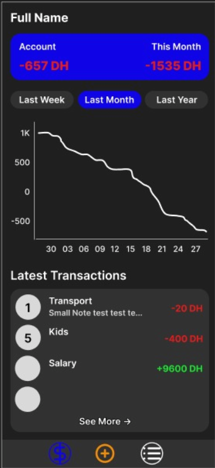

i made three versions of this page one for when the last week option is selected, another one for the last month and lastly one for the last year option

### fx:ids that are common between all of these 3 interfaces : 

fx:id of the full name label that will be changed by the name of the user : name

fx:id of the container (vBox) that will contain all the latest transactions : latest_transaction
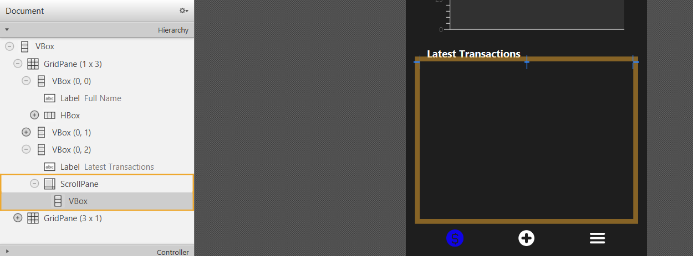
this vBox will be used to query the latest transactions and dynamically add them looking like this :

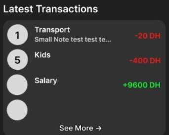

the nav bar fx:ids : (unified over all the pages that has a navbar)

 : fx:id = track

 : fx:id = menu

 : fx:id = add

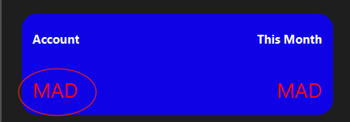

fx:id = Acc_tracker

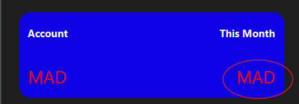

fx:id = month_tracker

the chart's fx:id = graph

### fx:id that are not comment between the 3 interfaces

the fx:ids changes for these labels :

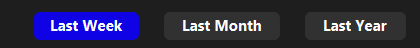

#### interface 1 : last_week_transactions
last week fx:id = last_week_clicked

last month fx:id = last_month

last year fx:id = last_year

#### interface 2 : last_month_transactions
last week fx:id = last_week

last month fx:id = last_month_clicked

last year fx:id = last_year

#### interface 3 : last_year_transactions
last week fx:id = last_week

last month fx:id = last_month

last year fx:id = last_year_clicked

# Add transaction

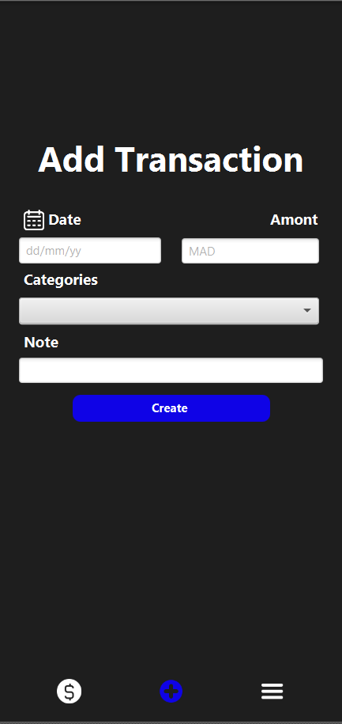

the fx:id of the navbar dont change

fx:id date text field : date

fx:id amont txt field : amont

fx:id categories text field : categories

fx:id of the categories items :
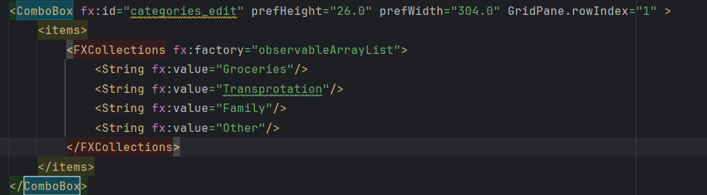

fx:id note text field : note
fx:id create button : create_button

# Edit transaction

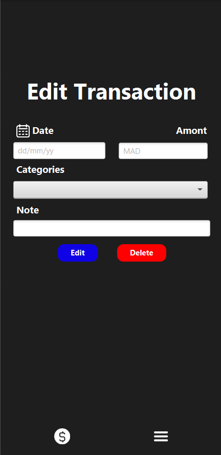

the fx:id of the navbar dont change

fx:id date text field : date_edit

fx:id amont txt field : amont_edit

fx:id categories text field : categories_edit

fx:id of the categories items :

fx:id note text field : note_edit
fx:id edit button : edit
fx:id delete button : delete

# Transaction menu 
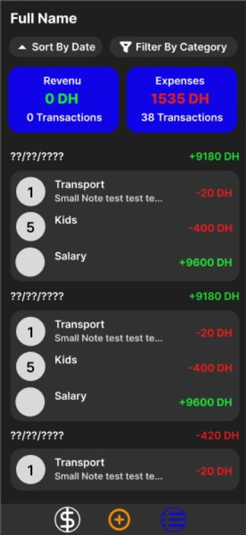
i made two versions for this interface : one for sorting by date and the second for filtering by category

#### the common fx:id between the 2 interfaces

fx:id of the full name label: name

fx:id of :
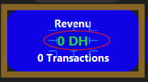 is total_revenu

fx:id of :
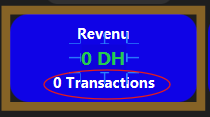 is total_transactions_revenu

fx:id of :
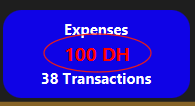 is total_expenses

fx:id of :
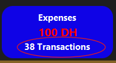 is total_transactions_expenses

fx:id of the vbox that will contain all the sorted or filtered transactions : sorted_transactions
they should dynamically appear as :

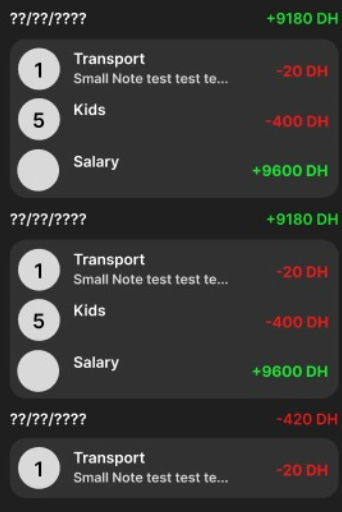

in the sorted_transactions Vbox

